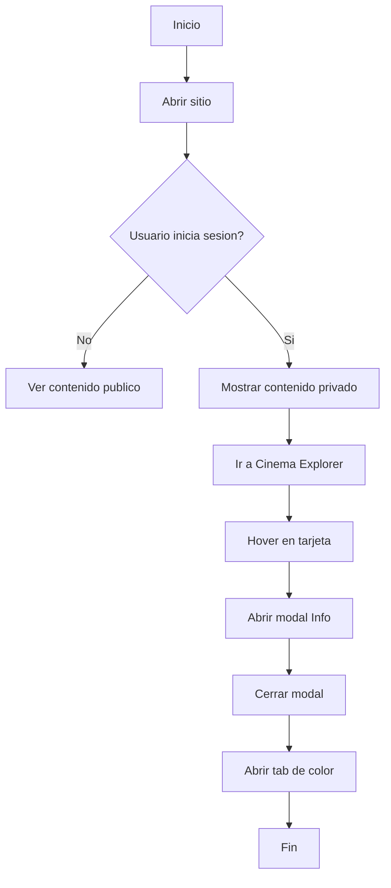

# UML — Diagrama de Actividad (Flujo Principal)

```mermaid
flowchart TD
  A[Inicio] --> B[Abrir sitio]
  B --> C{Usuario inicia sesion?}
  C -- No --> D[Ver contenido publico]
  C -- Si --> E[Mostrar contenido privado]
  E --> F[Ir a Cinema Explorer]
  F --> G[Hover en tarjeta]
  G --> H[Abrir modal Info]
  H --> I[Cerrar modal]
  I --> J[Abrir tab de color]
  J --> K[Fin]
```
