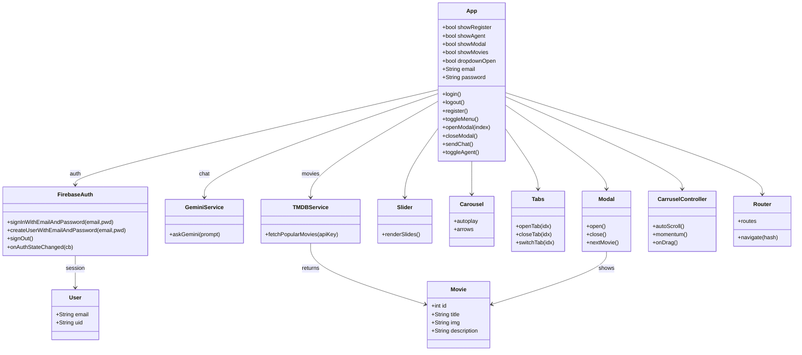
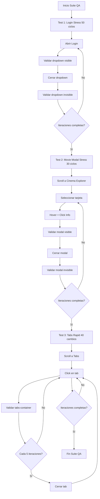

# UML — Diagrama de Clases (Portafolio)

```mermaid
classDiagram
    class App {
        +bool showRegister
        +bool showAgent
        +bool showModal
        +bool showMovies
        +bool dropdownOpen
        +String email
        +String password
        +login()
        +logout()
        +register()
        +toggleMenu()
        +openModal(index)
        +closeModal()
        +sendChat()
        +toggleAgent()
    }

    class User {
        +String email
        +String uid
    }

    class FirebaseAuth {
        +signInWithEmailAndPassword(email,pwd)
        +createUserWithEmailAndPassword(email,pwd)
        +signOut()
        +onAuthStateChanged(cb)
    }

    class GeminiService {
        +askGemini(prompt)
    }

    class TMDBService {
        +fetchPopularMovies(apiKey)
    }

    class Movie {
        +int id
        +String title
        +String img
        +String description
    }

    class Slider {
        +renderSlides()
    }

    class Carousel {
        +autoplay
        +arrows
    }

    class Tabs {
        +openTab(idx)
        +closeTab(idx)
        +switchTab(idx)
    }

    class Modal {
        +open()
        +close()
        +nextMovie()
    }

    class CarruselController {
        +autoScroll()
        +momentum()
        +onDrag()
    }

    class Router {
        +routes
        +navigate(hash)
    }

    App --> FirebaseAuth : auth
    App --> GeminiService : chat
    App --> TMDBService : movies
    App --> Slider
    App --> Carousel
    App --> CarruselController
    App --> Tabs
    App --> Modal
    App --> Router

    FirebaseAuth --> User : session
    TMDBService --> Movie : returns
Modal --> Movie : shows
```

---

# UML — Pruebas QA Automatizadas (Stress Selenium)

Este diagrama refleja las pruebas definidas en `src/lib/tests/test_portfolio_e2e.py`.

```mermaid
flowchart TD
  A[Inicio Suite QA] --> B[Test 1: Login Stress 50 ciclos]
  B --> B1[Abrir Login]
  B1 --> B2[Validar dropdown visible]
  B2 --> B3[Cerrar dropdown]
  B3 --> B4[Validar dropdown invisible]
  B4 --> B5{Iteraciones completas?}
  B5 -- No --> B1
  B5 -- Sí --> C[Test 2: Movie Modal Stress 30 ciclos]

  C --> C1[Scroll a Cinema Explorer]
  C1 --> C2[Seleccionar tarjeta]
  C2 --> C3[Hover + Click Info]
  C3 --> C4[Validar modal visible]
  C4 --> C5[Cerrar modal]
  C5 --> C6[Validar modal invisible]
  C6 --> C7{Iteraciones completas?}
  C7 -- No --> C2
  C7 -- Sí --> D[Test 3: Tabs Rapid 40 cambios]

  D --> D1[Scroll a Tabs]
  D1 --> D2[Click en tab]
  D2 --> D3[Validar tabs-container]
  D3 --> D4{Cada 5 iteraciones?}
  D4 -- Sí --> D5[Cerrar tab]
  D4 -- No --> D2
  D5 --> D2
  D2 --> D6{Iteraciones completas?}
  D6 -- No --> D2
  D6 -- Sí --> E[Fin Suite QA]
```
