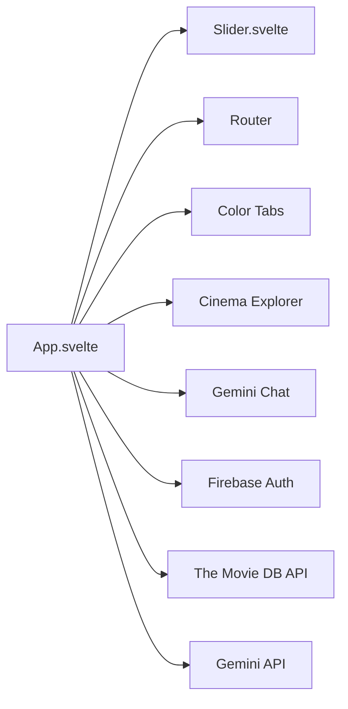

# UML — Diagrama de Componentes

```mermaid
flowchart LR
  App[App.svelte] --> Slider[Slider.svelte]
  App --> Router[Router]
  App --> Tabs[Color Tabs]
  App --> Cinema[Cinema Explorer]
  App --> Chat[Gemini Chat]

  App --> Firebase[Firebase Auth]
  App --> TMDB[The Movie DB API]
  App --> Gemini[Gemini API]
```
