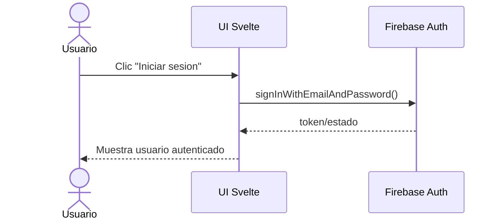

# UML — Diagrama de Secuencia (Login)

```mermaid
sequenceDiagram
  actor Usuario
  participant UI as UI Svelte
  participant Auth as Firebase Auth

  Usuario->>UI: Clic "Iniciar sesion"
  UI->>Auth: signInWithEmailAndPassword()
  Auth-->>UI: token/estado
  UI-->>Usuario: Muestra usuario autenticado
```
