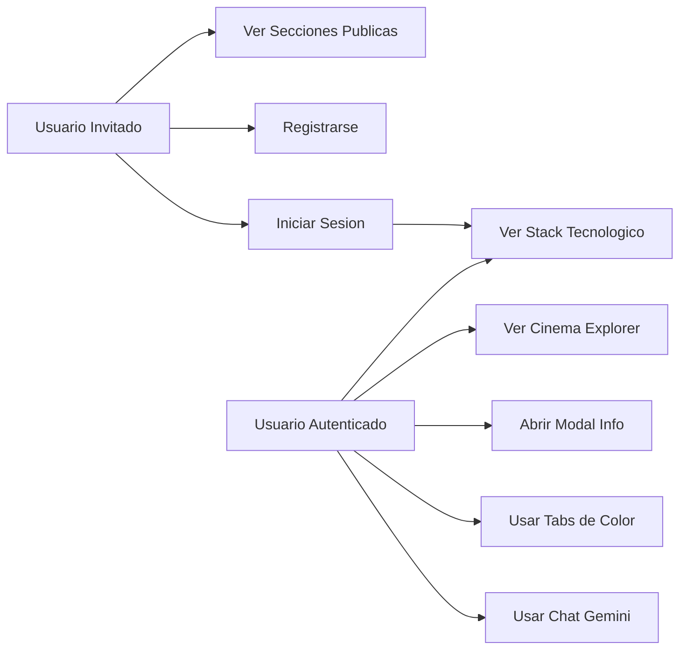

# UML — Casos de Uso

```mermaid
flowchart LR
  User[Usuario Invitado] --> UC1[Ver Secciones Publicas]
  User --> UC2[Registrarse]
  User --> UC3[Iniciar Sesion]

  Auth[Usuario Autenticado] --> UC4[Ver Stack Tecnologico]
  Auth --> UC5[Ver Cinema Explorer]
  Auth --> UC6[Abrir Modal Info]
  Auth --> UC7[Usar Tabs de Color]
  Auth --> UC8[Usar Chat Gemini]

  UC3 --> UC4
```
